# COVID-19 Analysis and Relationship with Other Medical Conditions
**Eri Midorikawa** 

## Project Summary

This project is a comprehensive data-driven exploration of the COVID-19 pandemic, focusing on analyzing the relations between COVID-19 and other diseases, comorbidities, and health conditions. The main part of this project is predicting whether the patients have COVID-19 or not based on their medical conditions. This project aims to provide valuable insights into the impact of COVID-19 on individuals with pre-existing medical conditions and to identify patterns and correlations.

## Problem Statement 

Develop a predictive model to identify and classify COVID-19 cases based on patients' medical conditions. The project involves leveraging machine learning techniques to analyze a medical dataset containing information about various medical conditions experienced by patients. The primary goal is to build a model that can predict whether a patient has COVID-19 or not based on the given medical conditions. The benchmark of this project would be Decesion Tree method due to it's simplisity. 

## Dataset 
[Covid-19 100k](https://synthea.mitre.org/downloads) is the datasets includeing One hundred thousand synthetic patients records with COVID-19 in the CSV format. This dataset is consist of these tables; allergies, careplans, conditions, devices, encounters, imaging_studies, immunizations, medications, observations, organizations, patients, payer_transitions, payers, procedures, providers, and supplies. Detail below is focused on data which is the most relavant tables to this project.

#### conditions (1143900, 6) 
**Id:** consultation ID 
**START:** Date that patients came to the health-care providers 
**STOP:** Date that patients recovered from the medical conditions 
**PATIENT:** Patient ID 
**ENCOUNTER:** Encounter ID (How they got medical care such as walk-in and emergency) 
**CODE:** condition ID  
**DESCRIPTION:** Type of condition the patient has  

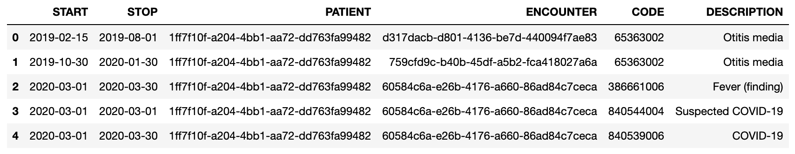

#### patients (124150, 25) 
**Id:** Patient ID 
**BIRTHDAY** 
**DEATHDATE** 
**SSN** 
**DRIVERS:** DL# 
**PASSPORT:** Passport# 
**PREFIX** 
**FIRST:** First name 
**LAST:** Last name 
**SUFFIX** 
**MAIDEN:** Maiden name 
**MARITAL** Marital status 
**RACE** 
**ETHNICITY** 
**GENDER** 
**BIRTHPLACE**  
**ADDRESS** Current mailing/living address of the patient 
**CITY:** Current city for the mailing/living address 
**STATE:** Current state for the mailing/living address 
**HEALTHCARE_COVERAGE:** The amount insurance company covered for the medical care  

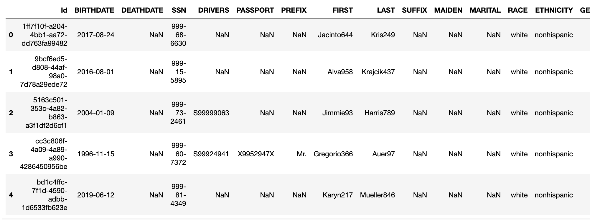

## Exploratory Data Analysis 
    
**Heatmap** - It will visualize the correlation between variables. Using a separate dataframe that limit patients to who actually have COVID-19, it displays the correlation between COVID-19 and each medical conditions. See the full Heatmap from the jupyter notebook. 
   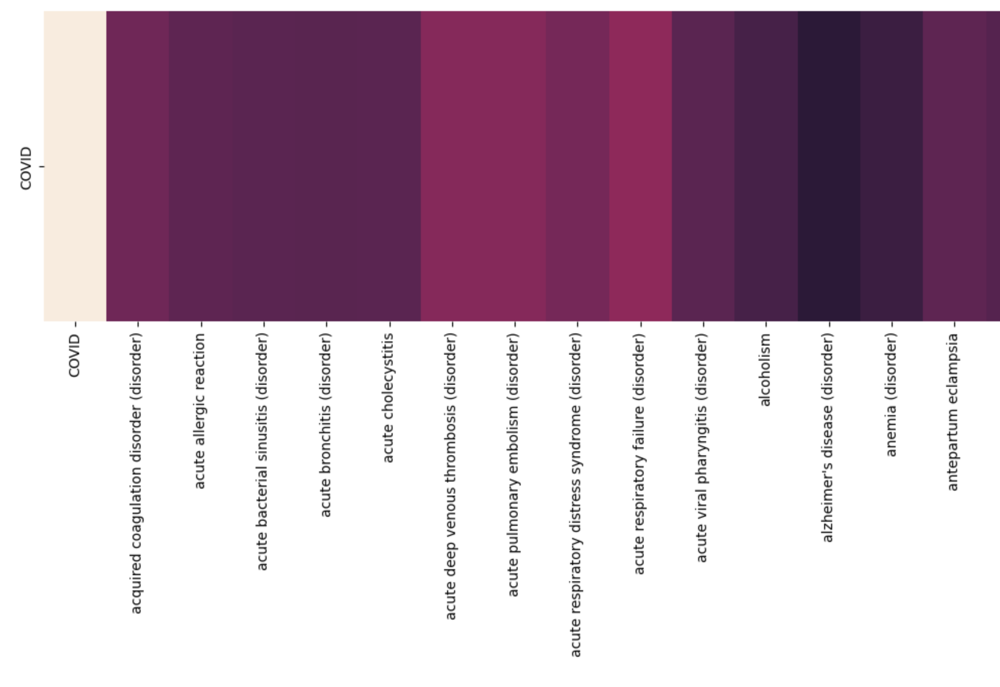
   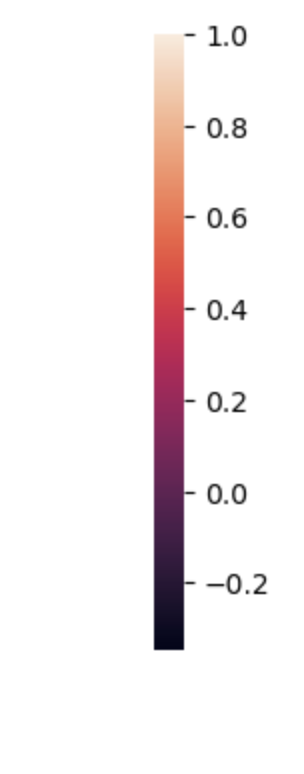

**Histogram** - It will be useful when we want to compare values. In this project, it is used to visualize the number of patients for each medical conditions. It sums up same the number of occurance of each medical conditions among the patients who have COVID-19 (using same tables as the Heatmap section), and display the top 10 of medical conditions with descending order. 

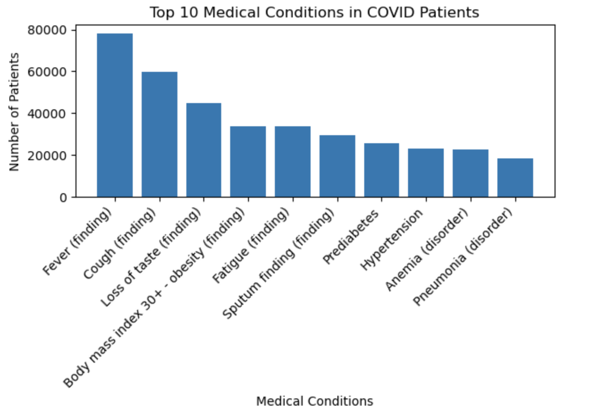
    
## Data Preprocessing 

The original table contains multiple same patients for each medical conditions, therefore it will be needed to make it available to see all conditions of each patients in one row.
The table below is the part of pre-prosecces table. Using ”COVID” columns as indicating whether the patient has COVID-19 or not. Rest of features are dummy variables for 191 medical conditions for the patient.

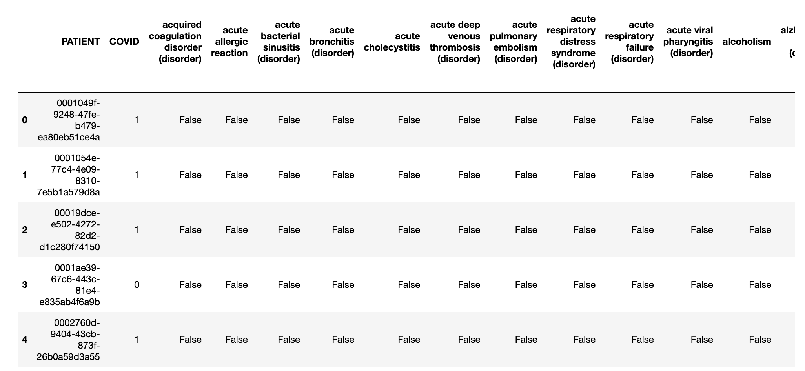

## Machine Learning Approaches

#### Baseline evaluation setup
Decision Trees stand out for their simplicity, offering a transparent and interpretable model. The decision-making rules employed by Decision Trees are easily comprehensible, facilitating a straightforward explanation of the model to non-technical stakeholders and domain experts. Moreover, the inherent capability of Decision Trees to seamlessly handle both numeric and categorical features proves advantageous for this project, where a significant portion of the data comprises categorical variables. 
    
#### ML mothods
This project only uses the table which pre-processed in the eariler section.

**Decision Tree:** Useful for binary outcomes, such as presence or absence of a particular health condition. It could help model the likelihood of individuals with specific medical conditions contracting severe COVID-19. 
**Support Vector Machines:** Effective for a complex classification tasks. It could be interesting to compare the result with the result of Decision Tree. 
**Gradient Boosting:** Gradient Boosting is the ensumble method of decision trees. It improve the tree as it create multiple trees and fix the residual of previous one.   

    
#### Family of machine learning algorithms

**Supervised Learning:** This dataset includes labeled data which are variety medical conditions, therefore, supervised Learning will be suitable for this problem.   

## Experiments 

This project uses precision and recall as the evaluation method for each model which uses best hyperparameters chosen by grid search and 5-folds coross validation. 
The image below compares Precision and Recall for each model:

   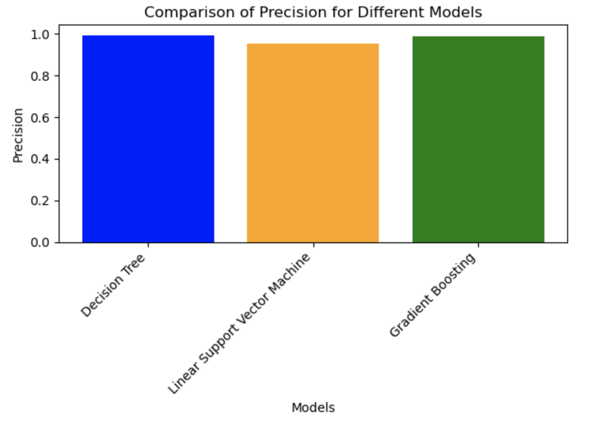
   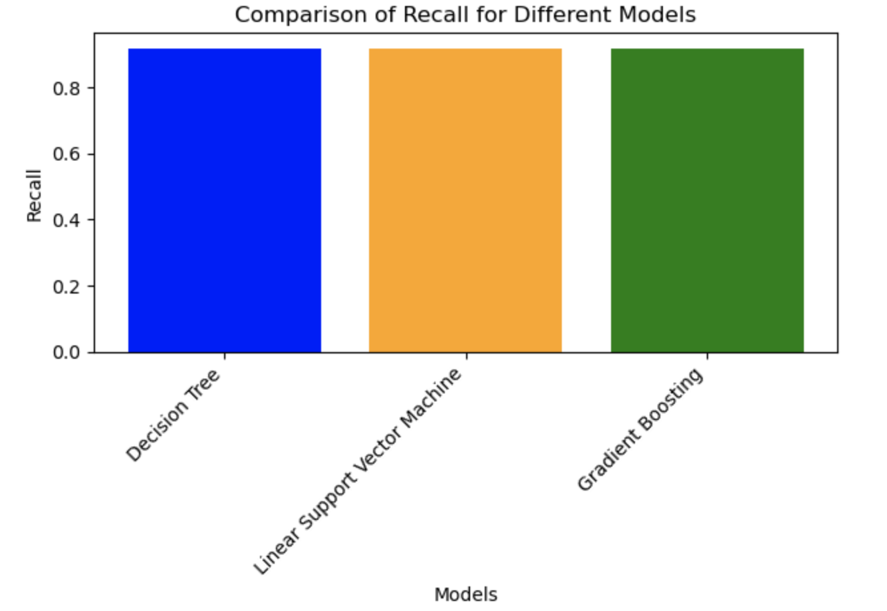

   
* Decision Tree which is the baseline method of this project did already very good job for this prediction. This possibly happened due to the kind of data using for training. This data only contains binary values, which is easy to handle for Decision Tree because the model does not need to specify the same feature multiple times (just true or false). 
The image below is the confusion matrix of the Decision Tree model:

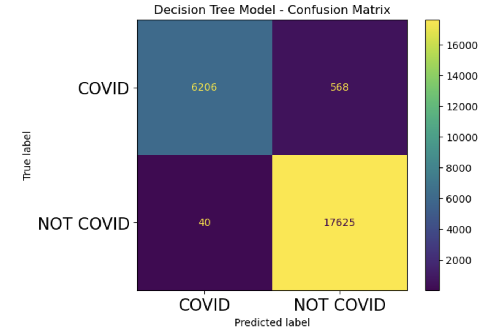

* Support Vector Machine did also pretty good job but slightly worse than Decision Tree. It has slightly larger number of false positives compare to the Decision Tree model.
The image below is the confusion matrix of the Support Vector Machine:

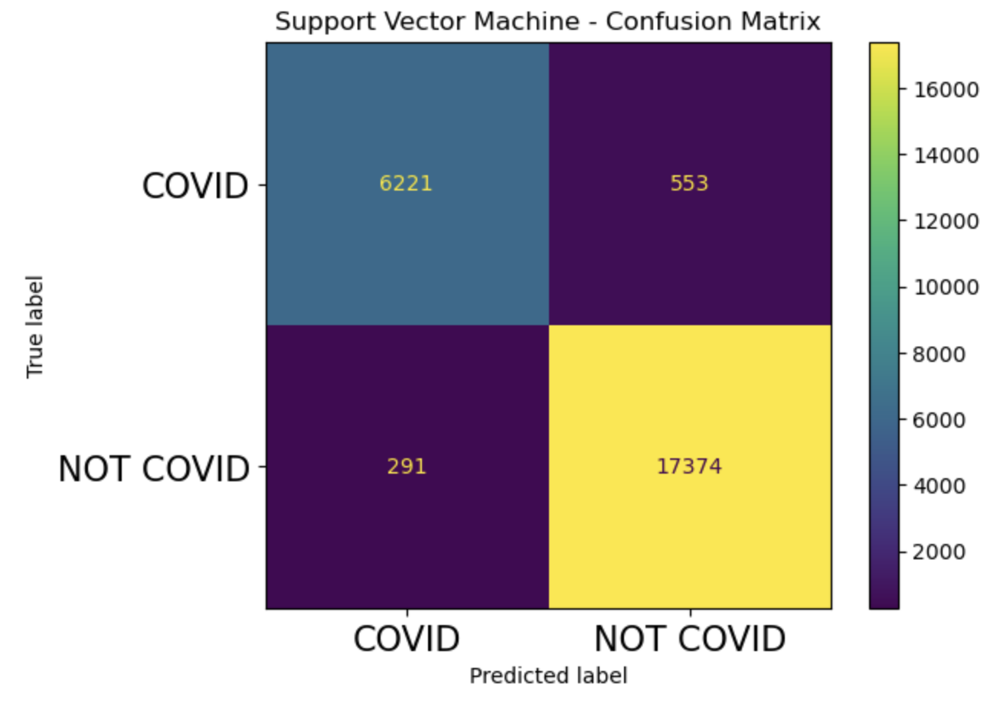

* Gradient Boosting also did not predict well as original Decision Tree, but better than SVN. It has little more false positives compare to the Decision Tree, but way less than SVM.
The image below is the confusion matrix of the Gradient Boosting:

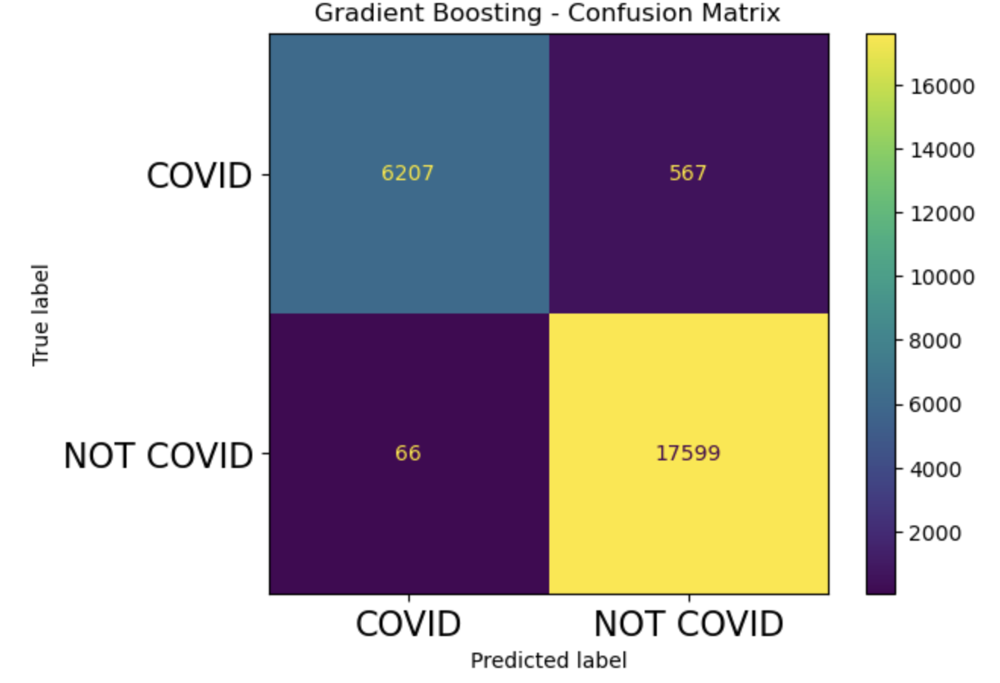

## Conclusion
All 3 models work very well. I think this happens because of simplicity of data. The data I used for training contained only binary categorical values, therefore models predict result fairy easily. In addition, the correlation between COVID-19 and medical conditions are very obvious. There are almost no noisy data that disrupts models performance. Farthermore, how I pre-processed data was worked very well. It increases data's simplicity and usability for my models.
Through this project, I could learn how to apply the knoledge of machine learning learned in the class and make it to useful research. By utilizing those models, I could understand deeply about how to pre-process the data and the machine learning methods.

